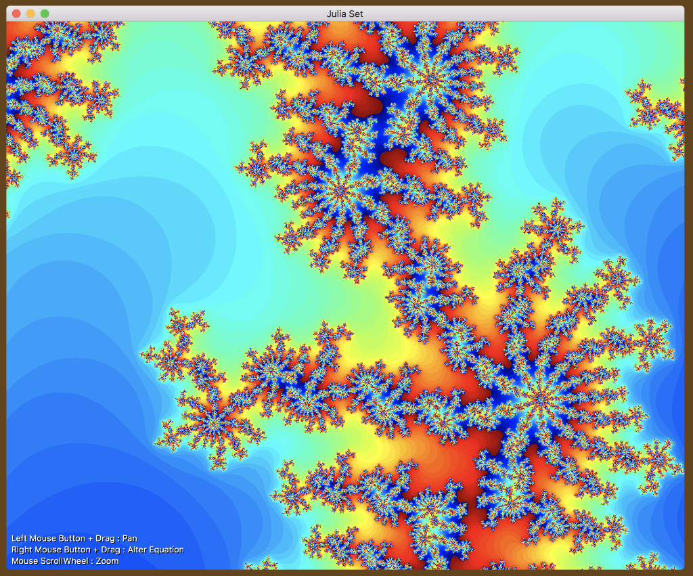

# OSX_BareBonesMetalView
Minimal App to draw Julia Set fractal for the Mac via Swift 4.2 and Metal

I takes surprisingly few lines of code to draw a Julia set with Swift and Metal. \
Here's an example..

